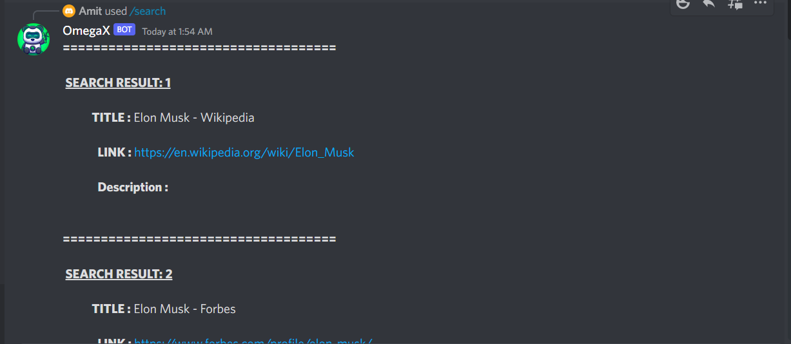
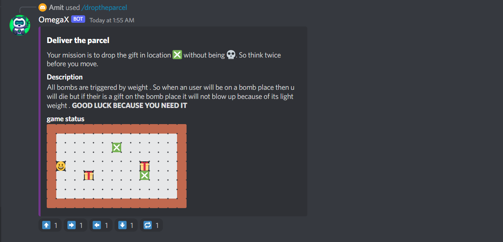
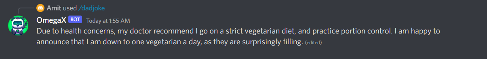

# OmegaX

OmegaX is a multifunctional discord bot which is made with the help of [discord.js](https://discordjs.guide/#before-you-begin) api and other various popular api for various functionalities like google search api , dadjoke api, weather api etc.

---

## How to install ?

- For installing first you need to fork this repository and get it in you local machine.
- then just like in demo.env file create **.env file** **no name required** and their you put of the credentials
- install node.js in your local system
- type `npm i` to install all the dependencies as well as dev dependencies.
- now type `npm start` in order to start the bot in you local system . You can also deploy it in a server so that the bot will be online everytime.

---

## Features of the bot

1. **Google search:** yes you can serach over the google with the omegaX. It is going to return first **5 results** on your server . So you are not required to leave your server for a google search while enjoying a hot topic with you friends or watching an intense game streaming.
2. **Dad jokes:** to light up your mood we have various dad jokes .
3. **Drop the parcel:** Its a **2D game** which you can play with omegaX. Your mission is to deliver the parcel in the given spot . But their is a twist . there are **5 landmines** in the grid one wrong step can lead you to **death**. So think twice before you make a move.
4. **Image to text converter:** Sometimes we wanted to extract the text from an image so bot will ask for the image you simply need to attach your image and omegaX will convert it to the text .
5. **Calculator:** you can calculate most of the things like a simple expression like 1+2/3\*4 or some trigonometric functions , or some constants like pi , e, etc

---

## Commands to use the bot

1. **Google Search :** for using this we need to write **/serach** then it will ask for a **querry** which is **compulsory** to be filled
2. **Dad jokes:** for using this we need to write **/dadjoke**
3. **Drop the parcel :** to play this game type **/droptheparcel** it will initiate the game and you can control by reacting to various emojis which will come with the game interface
4. **Image to text converter:** for getting the text out of the images you need to type **/imagetotext** this is going to ask for **file attachment** which is **compulsory** .
    

**NOTE: we recommend you NOT to upload a large size image it will take a long time to get the text**

5. **Calculator :** to use the calculator type **/calculator calulate** it will ask for an **expression** which is **compulory** to know more about it like how to use type **/calculator help**

# Screenshots

